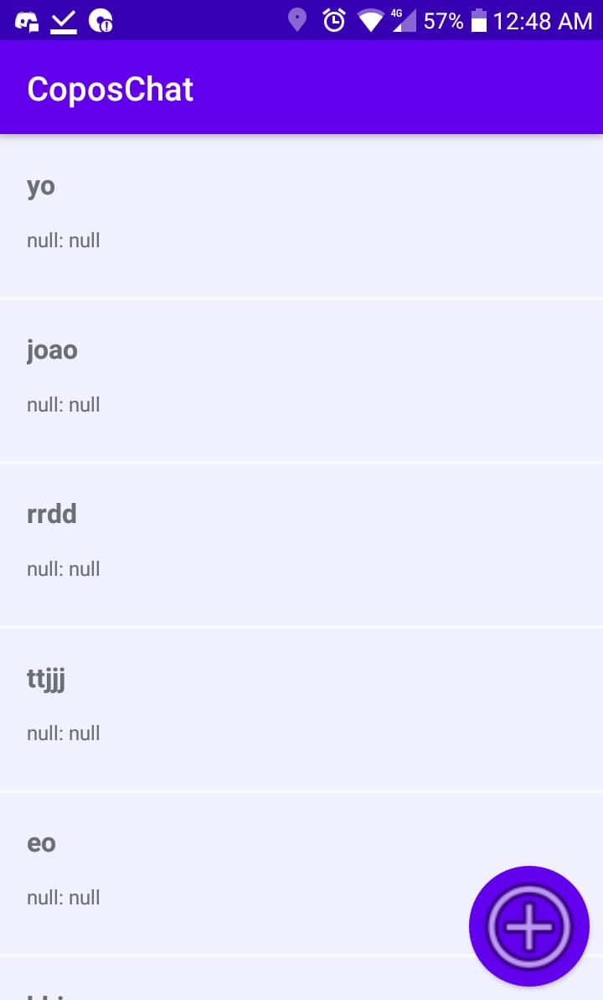
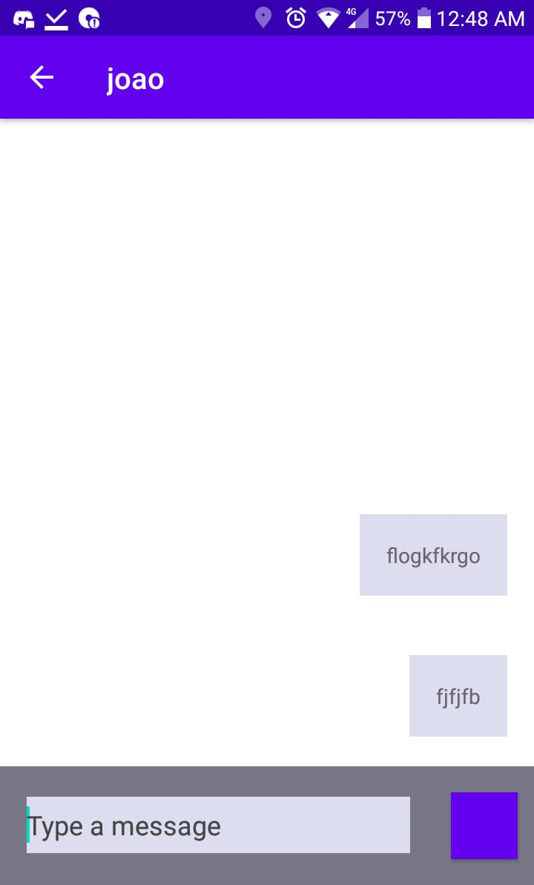

# CoposChat - App de Mensagens genérico
Curiosamente, o Coposchat hoje em dia nem é tão genérico, já que é um dos poucos apps de mensagens que não são capazes de enviar ou receber mensagens.

Brincadeiras à parte, ele tem certas implementações simples mas importantes no desenvolvmento android - RecyclerView, banco de dados com SQLite, etc. Ainda criarei um backend pra ele (estou pensando em .NET com SignalR).

    
    

